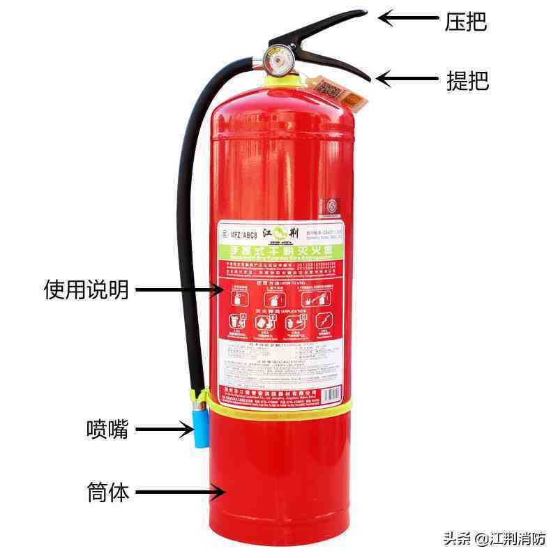

# 火灾

火灾是较为一种时间或空间上失去控制的燃烧[^1]。在各种灾害中，火灾是最经常、最普遍地威胁公众安全和社会发展的主要灾害之一。

## 火灾分类

火灾共分为七类

1. A类火灾：指固体物质火灾。这种物质通常具有有机物质性质，一般在燃烧时能产生灼热的余烬。如木材、干草、煤炭、棉、毛、麻、纸张等火灾。
2. B类火灾：指液体或可熔化的固体物质火灾。如煤油、柴油、原油、甲醇、乙醇、沥青、石蜡、塑料等火灾。
3. C类火灾：指气体火灾。如煤气、天然气、甲烷、乙烷、丙烷、氢气等火灾。
4. D类火灾：指金属火灾。如钾、钠、镁、钛、锆、锂、铝镁合金等火灾。
5. E类火灾：指带电火灾。物体带电燃烧的火灾。
6. F类火灾：指烹饪器具内的烹饪物（如动植物油脂）火灾。

## 燃烧

燃烧是一种放热发光的化学反应，通常伴有光、烟、或火焰。 可燃物、助燃物、着火源是燃烧三要素

## 灭火三要素

控制可燃物、减少氧气、降低着火点

## 扑灭小型火灾

!!! warning 警告
    火场及其危险，发生火灾时应当拨打119，切勿围观与进入火场。

扑灭火灾最简单的方法是使用灭火器，但对于不同类型的火灾对应的灭火器也不同。

- A类火灾: 水型灭火器、泡沫灭火器、磷酸铵盐干粉灭火器，卤代烷灭火器。
- B类火灾: 泡沫灭火器(化学泡沫灭火器只限于扑灭非极性溶剂)、干粉灭火器、卤代烷灭火器、二氧化碳灭火器。
- C类火灾: 干粉灭火器、水型灭火器、七氟丙烷灭火器。
- D类火灾: 粉状石墨灭火器、专用干粉灭火器，也可用干砂或铸铁屑末代替。
- E类火灾: 干粉灭火器、卤代烷灭火器、二氧化碳灭火器等
- F类火灾: 便携式食用油专用灭火器或者厨房设备灭火装置系统，或使用锅盖覆盖，阻隔氧气。

### 灭火器的使用方法

图 1-1(灭火器顶部细节图)

图 1-2(灭火器侧视图)

1. 确保压力表指针在绿色区域内
2. 拔下铅封和插销，摇晃灭火器(干粉灭火器要摇晃，使灭火剂充分混合)
3. 着火点上风方向2-5米的距离
4. 一只手提起灭火器，另一只手握住喷头，向火焰根部喷射。
5. 灭火后记得收看是否完全扑灭，确保不会复燃
6. 对于二氧化碳灭火器，需要保护好握住喷嘴的手，避免低温冻伤
7. **对于电器起火严禁使用水/水型灭火器**

## 自救

### 火场逃离

消防员到达火场、行动部署都需要时间，这段时间里我们只能靠自己。

#### 单元式住宅

单元式住宅是最常见的建筑形式，每一层一般为2-4个住户，一层一般只有一个楼梯。

1. 当警报(如有)响起时，不要以为是演习
2. 永远不要假设别人已经打过119
3. 慢跑鞋或运动鞋会比拖鞋更好
4. 策划逃跑路线，向上还是向下。如果火灾发生位置在你的下方，显然向下逃跑不是最优解，因为要考虑爆炸、闪燃等问题。
5. 开门之时，先用手背碰一下门把。如果门把烫手，或门隙有烟冒进来，切勿开门。**切记使用手心，烫伤手心后你将会失去大部分的抓握能力**
6. 用水浸湿的衣物捂住口鼻，弯腰或匍匐前进

#### 高层建筑

全球共有数以万计的高层建筑，根据CTBUH(世界高层建筑与都市人居学会)的统计,截至2019年,全球共有超过1603座高达200米及以上的高层建筑[^2]。中国内地和美国分列第一、第二,分别有超过600座和500多座的200米以上高楼。这些高层建筑为人们的工作生活提供了便利,但一旦发生火灾,也会带来巨大的伤亡风险。

2010年11月15日14时，上海余姚路胶州路一栋高层公寓起火。公寓内住着不少退休教师，起火点位于10-12层之间，整栋楼都被大火包围着，楼内还有不少居民没有撤离. 事故原因，是由无证电焊工违章操作引起.[^3]

当您遇到火情时我建议：

- 当警报(如有)响起时，不要以为是演习
- 永远不要假设别人已经打过119
- 如果有运动鞋，最好换上
- 听从或跟随安保人员的知识
- 大楼通常情况下会设置火灾楼梯，注意分别避难走道与自用楼梯。
- 不要乘坐电梯，电梯可能会因为高温而变形卡死，有些电梯则会返回一楼或在某一楼常开门，你将会错失逃生机会。
- 不要恐慌，恐惧会传染
- 策划逃跑路线，逃跑还是避险。
    - 一般情况下，高于10层的高楼都会设置两个逃生通道，只要不是浓烟滚滚，最好是考虑逃生，如果逃生通道已经存在浓烟，则要考虑使用另一个逃生通道

-  用水浸湿的衣物捂住口鼻，弯腰或匍匐前进
-  保持冷静，不要大喊大叫、相互争吵、相互说话，避免吸入大量浓烟。

## 帮助他人

有时我们可能面对的并不是火灾，还有可能是其他被烧伤或点着了火的人

### 烧伤

烧伤是由高温、化学物质或电引起的组织损伤。烧伤的程度由温度的高低、作用时间的长短而不同。局部的变化可分为四级。

- 浅表烧伤：烧伤皮肤呈红色，轻压出现明显和广泛的苍白，伴疼痛和触痛。一般不发生小囊和水疱[^4]
- 浅Ⅱ度烧伤：烧伤皮肤压之发白，伴疼痛及压痛。 24小时内出现小囊和水疱。小囊和水疱底部呈粉红色，然后出现纤维渗出。[^4]
- 深Ⅱ度烧伤：烧伤皮肤呈白色、红色或红白相间。与浅Ⅱ度烧伤相比，深II度烧伤皮肤压之少见发白，不伴疼痛和压痛。针刺感常被解释为压迫性而非尖锐性。小囊和水疱可能出现。这类烧伤通常较干燥。[^4]
- 全层烧伤：烧伤皮肤可以苍白柔软、发黑焦痂、棕色坚硬，或由于红细胞沉积于皮下而呈现鲜红色。苍白色全层烧伤除了皮肤受压不变白之外类似正常皮肤。全层烧伤常无痛觉或痛觉减退。毛发可以轻易从毛囊中拔出。通常不出现小囊和水疱。有时需要24-48小时才能区别全层烧伤和深Ⅱ度烧伤。[^4]

#### 浅表烧伤与浅度烧伤

- 冷水冲洗伤口，降低温度
- 用无菌纱布覆盖创面，不宜过紧
- 适当应用非处方类止痛药，使用前阅读说明书或遵医嘱

浅度烧伤一般无需进一步处理即可痊愈，痊愈后伤口出可能会出现色素沉着。

#### 深度烧伤

!!! warning 警告
    深度烧伤必须就医，你所做的只能是尽可能的帮助患者坚持到专业医生到来

1. 切勿强力撕脱创面衣裤，可以用冷水冲淋后剪开取下，但切勿强力撕脱以免引起二次损伤。
2. 摘下创面的首饰
4. 切勿将大面积深度烧伤浸入冷水中，以免引起体温和血压急剧降低
5. 观察患者精神状况，如发现呼吸或心脏骤停，立刻进行心肺复苏
6. 抬高烧伤肢体，尽可能高于心脏水平
7. 覆盖烧伤创面，可以使用透气干燥的无菌绷带。
8. 不要涂抹紫药水或红药水，避免干扰医护人员的判断

### 被火焰点着

被火焰点着后，**不要奔跑**、**立刻躺下打滚或跳入水池中**、**身边的人可以使用衣服或厚被子拍打**

## 预防

预防是最好的自救，如果你不幸深陷火灾

1. 合理使用电器，避免短路
2. 严格控制火源与可燃物接触
3. 使用液化气做饭要经常检查燃气阀门，防止泄漏。一旦发现燃气泄漏，要迅速关闭气源阀门，打开门窗通风，切勿触动电器开关和使用明火，并迅速通知专业维修部门来处理。
4. 离家或睡觉前要检查电器具是否断电，燃气阀门是否关闭，明火是否熄灭。
5. 不乱接乱拉电线，电路熔断器切勿用铜、铁丝代替。
6. 利用电器或灶膛取暖，烘烤衣物，要注意安全。

[^1]: https://openstd.samr.gov.cn/bzgk/gb/newGbInfo?hcno=46B246CD909C546B33C2FB2BECC320A6
[^2]: https://global.ctbuh.org/resources/papers/4248-07b_TBIN.pdf
[^3]: https://baike.baidu.com/item/11%C2%B715%E4%B8%8A%E6%B5%B7%E9%9D%99%E5%AE%89%E5%8C%BA%E9%AB%98%E5%B1%82%E4%BD%8F%E5%AE%85%E5%A4%A7%E7%81%AB/8608055
[^4]: https://www.msdmanuals.cn/professional/injuries-poisoning/burns/burns